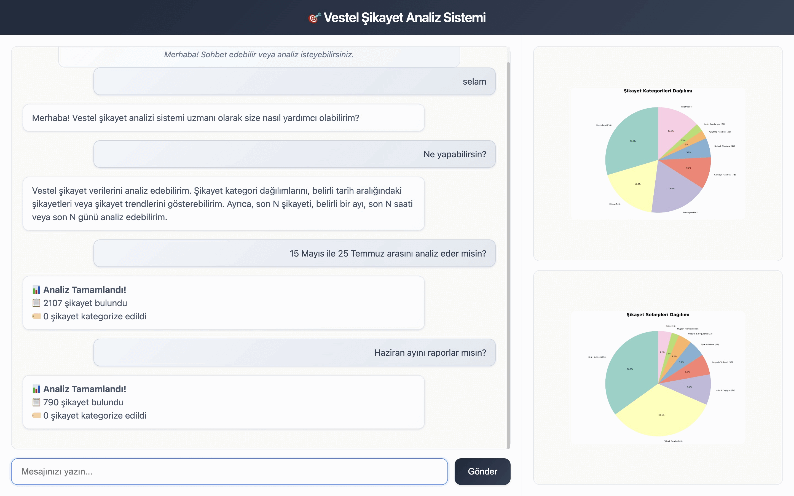

# 🎯 Vestel Şikayet Analiz Sistemi
<p align="center">
  
</p>
🎯 Proje Amacı

Bu sistem, Vestel markasına ait şikayetleri otomatik olarak toplayan, analiz eden ve görselleştiren kapsamlı bir AI çözümüdür. Proje, modern web scraping teknikleri, doğal dil işleme ve makine öğrenmesi ile şikayet verilerini anlamlı insights'lara dönüştürür.

- **Kategori Tespiti**: 59 farklı Vestel ürün kategorisi
- **Sebep Analizi**: 10 ana şikayet sebebi kategorilendirmesi
- **Fuzzy Matching**: LLM çıktılarını mevcut kategorilerle akıllı eşleştirme
  - *Örnek: "Şikayetvar.com sitesindeki şikayet içeriği" → "Televizyon", "Teknik Servis"*
- **JSONL Processing**: Verimli analiz

### Ana Hedefler:
- 🤖 **Otomatik Veri Toplama**: Şikayet sitelerinden anlık veri çekme
- 🧠 **AI Destekli Analiz**: Google Gemini LLM ile şikayet kategorilendirme
- 📊 **Görselleştirme**: İnteraktif grafikler ve istatistikler
- 💬 **Doğal Dil Arayüzü**: Kullanıcılarla sohbet edebilen AI asistan
- ⚡ **Gerçek Zamanlı**: Incremental update ile sürekli güncelleme

## 🏗️ Sistem Mimarisi

### Multi-Agent Architecture

```
┌─────────────────────────────────────────────────────────────┐
│                    🌐 WEB INTERFACE                         │
│                   (Flask + HTML/CSS/JS)                    │
└─────────────────┬───────────────────────────────────────────┘
                  │
┌─────────────────▼───────────────────────────────────────────┐
│                 🧠 ROOT AGENT                               │
│              (LLM Destekli Koordinatör)                    │
│  • Doğal dil komut analizi                                 │
│  • Agent koordinasyonu                                     │
│  • Chat & Analysis routing                                 │
└─────────┬─────────────────────────┬─────────────────────────┘
          │                         │
┌─────────▼──────────┐     ┌─────────▼─────────────────────────┐
│  📊 DATA AGENT     │     │    🔍 ANALYSIS AGENT             │
│                    │     │                                  │
│ • Scrapy yönetimi  │     │ • LLM ile kategorilendirme      │
│ • Veritabanı ops   │     │ • JSONL processing              │
│ • Incremental sync │     │ • Fuzzy string matching         │
│ • Spider control   │     │ • Analysis validation           │
└─────────┬──────────┘     └──────────────────────────────────┘
          │
┌─────────▼──────────────────────────────────────────────────┐
│               🕷️ SCRAPY SPIDER                             │
│                (Playwright + SQLite)                      │
│  • Vestel şikayet scraping                               │
│  • Duplicate detection                                    │
│  • Pipeline processing                                    │
│  • Real-time data collection                             │
└───────────────────────────────────────────────────────────┘
```


## ✨ Özellikler

### 🤖 AI Destekli Chat Interface
- **Doğal Dil İşleme**: "Son 24 saat", "Mart ayı", "Son 50 şikayet" gibi komutları anlama
- **Akıllı Routing**: Chat ve analiz isteklerini otomatik ayırma
- **Selamlaşma Desteği**: Temel sohbet yetenekleri
- **Guardrails**: İlgisiz sorulardan koruma

### 📊 Veri Toplama & Yönetim
- **Incremental Scraping**: Sadece yeni şikayetleri toplama
- **Duplicate Detection**: URL bazlı tekrar kontrolü
- **Real-time Processing**: Anında veritabanı güncellemesi
- **Batch Operations**: Toplu veri işleme

### 🔍 Akıllı Analiz
- **Kategori Tespiti**: 59 farklı Vestel ürün kategorisi
- **Sebep Analizi**: 10 ana şikayet sebebi kategorilendirmesi
- **Fuzzy Matching**: LLM çıktılarını mevcut kategorilerle eşleştirme
- **JSONL Processing**: Verimli analiz

### 📈 Görselleştirme
- **İnteraktif Grafikler**: Pie chart'lar ile kategori dağılımları
- **Büyütebilir Görseller**: Overlay ile detaylı inceleme
- **Responsive Design**: Mobil uyumlu arayüz
- **Real-time Updates**: Canlı grafik güncellemeleri

## 🛠️ Teknoloji Stack

### Backend
- **Python 3.8+** - Ana programlama dili
- **Flask** - Web framework
- **Scrapy** - Web scraping framework  
- **Playwright** - Modern browser automation
- **SQLite** - Hafif veritabanı çözümü
- **Google Gemini AI** - Doğal dil işleme

### Frontend
- **HTML5/CSS3** - Arayüz tasarımı
- **JavaScript (ES6+)** - İnteraktif özellikler
- **Modern CSS** - Flexbox, Grid, Animations
- **Responsive Design** - Mobile-first approach

### Data & Analytics
- **Matplotlib** - Grafik oluşturma
- **JSON/JSONL** - Veri formatları
- **SQLite3** - Veritabanı

## 🚀 Kurulum

### 📋 Sistem Gereksinimleri
```bash
🐍 Python 3.8+ (Önerilen: Python 3.9+)
📦 pip (Python paket yöneticisi)
🔑 Google API Key (Gemini AI erişimi için)
🌐 Chrome/Chromium (Playwright için)
```

#### 2️⃣ **Virtual Environment Oluşturma** ⭐
```bash
# Virtual environment oluştur
python -m venv venv

# Aktif et (Linux/macOS)
source venv/bin/activate

# Aktif et (Windows)
venv\Scripts\activate

# Doğrula
which python  # Linux/macOS
where python   # Windows
```

#### 3️⃣ **Bağımlılıkları Yükleme**
```bash
# Ana paketler
pip install -r requirements.txt

# Güncelleme (opsiyonel)
pip install --upgrade pip
```

#### 4️⃣ **Environment Konfigürasyonu** 🔧
`.env` dosyası oluşturun (proje kök dizininde):
```env
# AI API Anahtarı
GOOGLE_API_KEY=your_gemini_api_key_here

# Logging Seviyesi
LOG_LEVEL=INFO

# Database Path (opsiyonel)
DATABASE_PATH=./sikayetvar.db

# Flask Ayarları
FLASK_ENV=development
FLASK_DEBUG=true
```

## 📖 Kullanım

### 1. Web Arayüzünü Başlatma
```bash
python app.py
```
Tarayıcıda `http://localhost:5000` adresine gidin.

### 2. Chat Komutları

#### Selamlaşma & Genel
```
Selam
Sen kimsin?
Nasılsın?
Bu sistem nasıl çalışır?
```

#### Analiz Komutları
```
Son 10 şikayeti analiz et
Son 24 saati analiz et
Son 3 günü analiz et
Mart ayını analiz et
2025-01-01 2025-01-31 arası analiz et
```

## 🤖 Agent Mimarisi

### 🧠 Root Agent
**Rol**: Sistem koordinatörü ve LLM arayüzü

**Sorumluluklar**:
- Kullanıcı komutlarını LLM ile analiz etme
- Chat ve analiz isteklerini ayırma
- Diğer agentları koordine etme
- Final sonuçları birleştirme
- Grafik oluşturma yönetimi

### 📊 Data Management Agent
**Rol**: Veri toplama ve veritabanı yönetimi

**Sorumluluklar**:
- Scrapy spider'ları yönetme
- Incremental database updates
- Veri filtreleme ve hazırlama
- JSONL format dönüşümleri
- Database operasyonları

### 🔍 Analysis Agent
**Rol**: AI destekli şikayet analizi

**Sorumluluklar**:
- LLM ile batch şikayet analizi
- Kategori ve sebep tespit etme
- JSONL response parsing
- Validation ve error handling


## 🗄️ Veritabanı Yapısı

### complaints Tablosu
```sql
CREATE TABLE complaints (
    Complaint_ID INTEGER PRIMARY KEY AUTOINCREMENT,
    ref_url TEXT UNIQUE NOT NULL,           -- Benzersiz şikayet URL'i
    title TEXT,                             -- Şikayet başlığı
    full_comment TEXT,                      -- Tam şikayet metni
    date TEXT,                              -- Şikayet tarihi
    created_at DATETIME DEFAULT CURRENT_TIMESTAMP
);
```

### Analysis Tablosu
```sql
CREATE TABLE Analysis (
    Analysis_ID INTEGER PRIMARY KEY AUTOINCREMENT,
    Complaint_ID INTEGER UNIQUE,            -- Her şikayet için tek analiz
    Category TEXT,                          -- Ürün kategorisi
    Reason TEXT,                           -- Şikayet sebebi
    created_at DATETIME DEFAULT CURRENT_TIMESTAMP,
    FOREIGN KEY (Complaint_ID) REFERENCES complaints (Complaint_ID)
);
```

### 🚀 Performans Optimizasyonları

#### Otomatik Index'ler
```sql
-- UNIQUE constraint otomatik index oluşturur
sqlite_autoindex_complaints_1 ON complaints(ref_url)  -- O(log n) lookup
sqlite_autoindex_Analysis_1 ON Analysis(Complaint_ID) -- O(log n) lookup
```

#### Manuel Index'ler  
```sql
-- Tarih bazlı sorgular için
CREATE INDEX idx_complaints_date ON complaints (date);

-- JOIN performansı için
CREATE INDEX idx_analysis_complaint_id ON Analysis (Complaint_ID);
```

#### Duplicate Detection Stratejisi
```python
# ✅ Hızlı duplicate kontrolü
cursor.execute('SELECT 1 FROM complaints WHERE ref_url = ?', (ref_url,))

# ❌ Yavaş alternatif
cursor.execute('SELECT * FROM complaints WHERE ref_url = ?', (ref_url,))
```

**Performans Metrikleri:**
- 🔍 **URL Lookup**: ~0.001ms (B-tree index sayesinde)
- 💾 **Incremental Insert**: ~10-50ms (batch operations)
- 🔄 **Duplicate Skip**: ~0.1ms (early exit)

### Ürün Kategorileri (59 adet)
```
Akıllı Priz, Akıllı Saat, Akıllı Tahta, Akıllı Tartı, Ankastre Fırın,
Ankastre Ocak, Ankastre Set, Aspiratör, Bilgisayar, Blender,
Bulaşık Makinesi, Buzdolabı, Çamaşır Makinesi, Televizyon, Klima,
Mikrodalga, Robot Süpürge, Kurutma Makinesi, ...
```

### Şikayet Sebepleri (10 adet)
```
1. Teknik Servis
2. Kargo & Teslimat
3. Müşteri Hizmetleri
4. Fiyat & Fatura
5. Ürün Kalitesi
6. Website & Uygulama
7. İade & Değişim
8. Satış & Mağaza
9. Zaman & Süreç
10. Diğer
```
